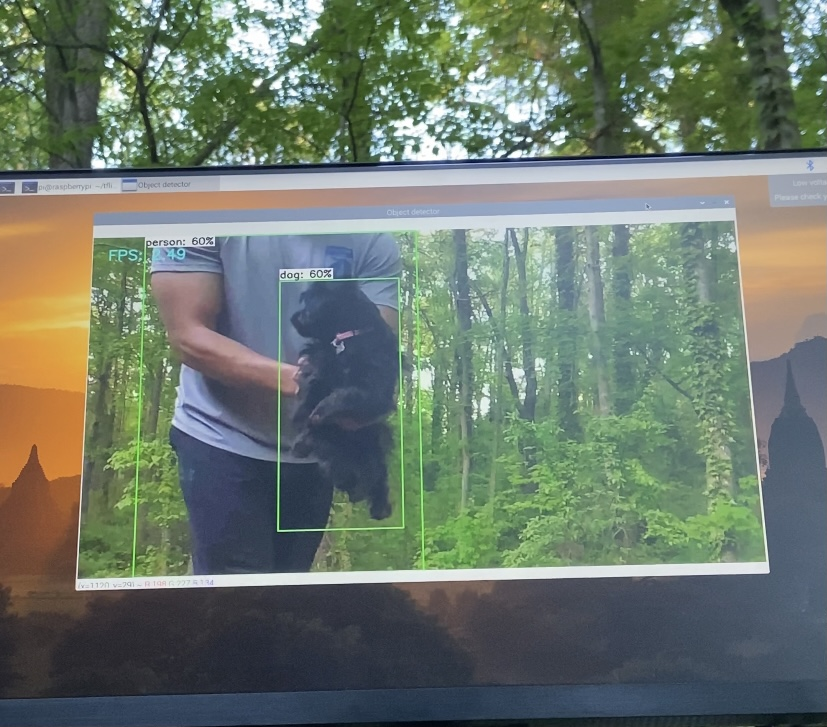
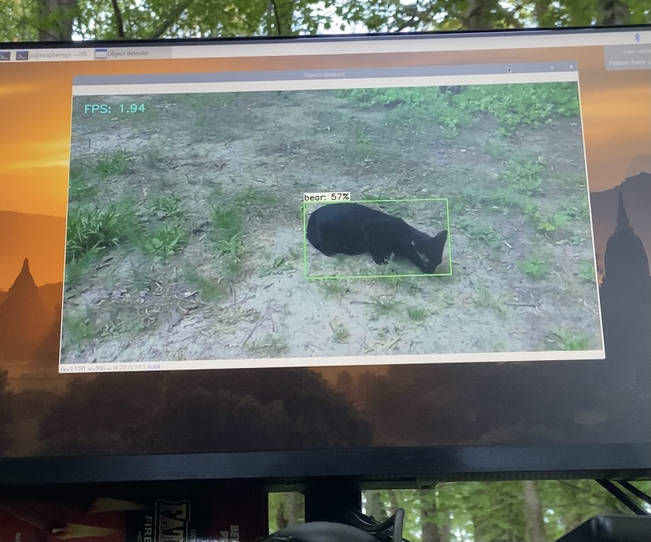
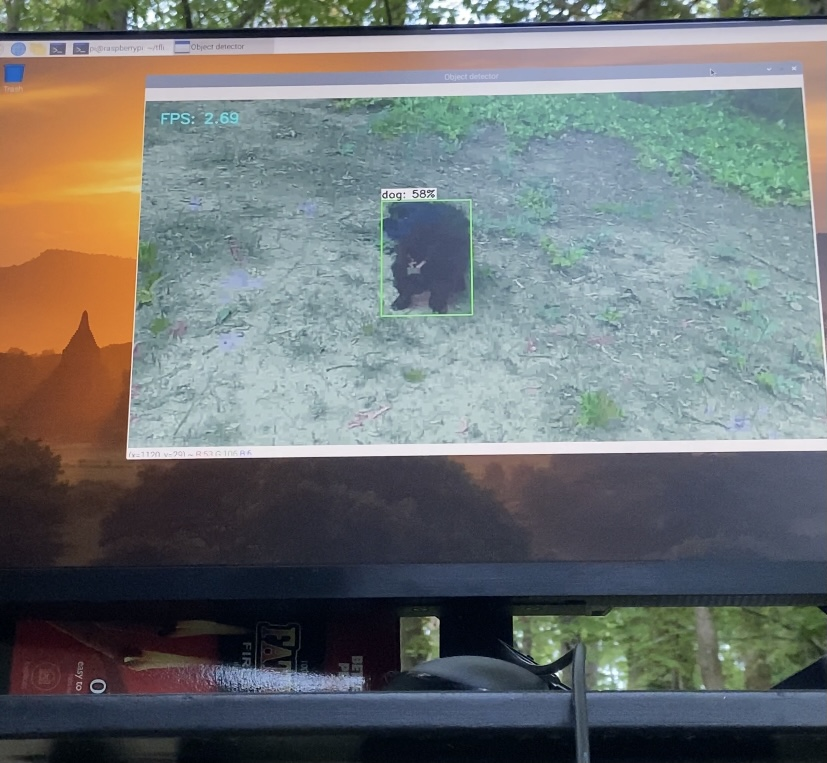

<h1 align="center">Raspberry Pi Computer Vision </h1>

_______
The purpose of this project was to gain knowledge utilizing computer vision and APIs. I was able to program my Raspberry Pi to utilize TensorFlow in Python to analyze webcam video into objects known by the computer. This is just one step into understanding the capabilities of AI and Machine Learning. 
_______
</img>
______
Issues:
- Improper Picamera configuration
- 1 Raspberry Pi overheated 😓 and passed away ...
- API Keys from Azure Coginitive Service did not process in Python (initially)
- Issues connecting Picamera to Python

Lessons Learned:
- Implementing an Azure resource API in Python
- Object Detection with Computer Vision
- Train a computer using Custom Vision

Future Projects:
- Build a more indepth Custom Vision database on Azure
- Use text-speech cognitive service on Azure

</img>

</img>
*It is not always the most accurate... Apparently I have a pet bear!*

</img>
