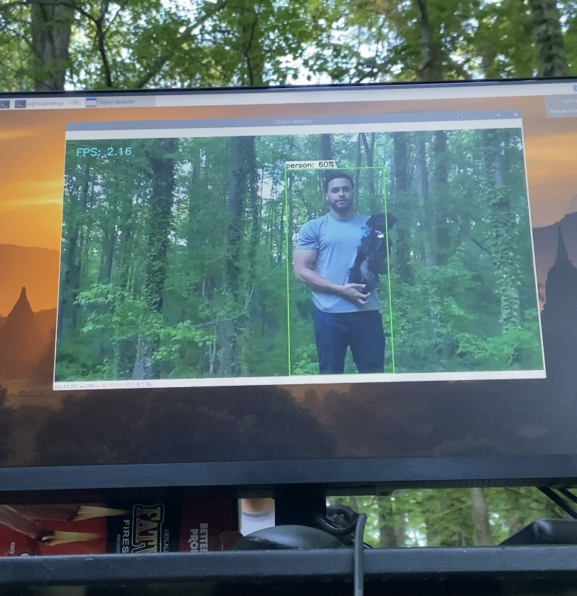

<h1 align="center">Raspberry Pi Computer Vision </h1>

_______
The purpose of this project was to gain knowledge utilizing computer vision and APIs. I was able to program my Raspberry Pi to utilize TensorFlow in Python to analyze webcam video into objects known by the computer. This is just one step towards understanding the capabilities of AI and Machine Learning. The computer vision database used during this project was Microsofts Common Objects in Context (COCO) and Microsoft Azure Computer Vision cognitive service.
_______
</img>
______
Issues:
- Improper Picamera configuration
- 1 Raspberry Pi overheated 😓 and passed away ...
- API Keys from Azure Coginitive Service did not process in Python (initially)
- Issues connecting Picamera to Python

Lessons Learned:
- Implementing an Azure resource API in Python
- Object Detection with Computer Vision
- Train a computer using Custom Vision

Improvements:
- Build a more indepth Custom Vision database on Azure
- Use text-speech cognitive service on Azure
- Learn more about APIs

_____
Great Tutorial and Follow Along:
https://www.youtube.com/watch?v=aimSGOAUI8Y&t=503s

Information and Troubleshooting Resource Github:
https://github.com/EdjeElectronics/TensorFlow-Lite-Object-Detection-on-Android-and-Raspberry-Pi

</img>

</img>

*Common Objects in Context is not always the most accurate... Apparently I have a pet bear!*

</img>
